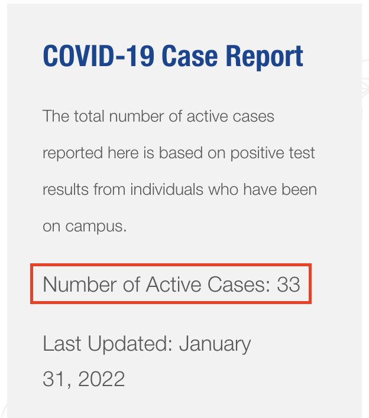

# JISNET Covid Tracker
This repo is a tracker for the number of confirmed COVID-19 cases in JIS. It scrapes the student [jisedu website](https://www.jisedu.or.id/student) using selenium and then creates a notification whenever new cases appear.



**Note: The jisedu.or.id website might be modified in the future so this webscraper may not work properly.**

## Setup
`password.json`
```
{
    "username": "00000", # replace with your id
    "password": "MYPASSWORD" # replace with your jisedu password
} # this file is not completely required to run this app. But if you decide to run it --headless, you must create this file and input it as --credentials.
```

`chromedriver`
* Find your chrome version. Open the link `chrome://version` in google chrome and find the corresponding chromdriver version on the [chromium downloads](https://chromedriver.chromium.org/downloads). Or you can run `Applications/Google\ Chrome.app/Contents/MacOS/Google\ Chrome --version`. 
* Once you download chromedriver, go to folder, right click chromedriver and click `run`. Or, you can paste the path of chromedriver onto terminal and run it (eg `~/Downloads/chromedriver/). This will test that your chromedriver version is correct and the rest should work properly.
* Copy chromedriver to your path. You can either add chromedriver to a folder that is added to path (like `/usr/local/bin/`) or explicitly add it to path by `export PATH=$PATH:/path/to/driver/chromedriver`. However, this will only run on the current session. So the solution is to add this command to your `.zshrc` or `.bashrc` file.


## Running
Simply, you can run `bash run.sh` and it will automatically download dependencies and run the task in the background.
You can also run:
```
>> python main.py # supply additional parameters like --headless or --update-time 

>> python main -h # (run with -h to get help)
usage: main.py [-h] [--update-time UPDATE_TIME] [--dry DRY] [--headless]
               [--credentials CREDENTIALS]

options:
  -h, --help            show this help message and exit
  --update-time UPDATE_TIME, -t UPDATE_TIME
                        Interval time for each update in seconds
  --dry DRY, -d DRY     Case value for dry run (default 25)
  --headless, -hd       Run selenium chromedriver in headless mode
  --credentials CREDENTIALS, -c CREDENTIALS
                        Path to JSON credential file (with fields "username"
                        and "password")
```
**Note: this app should be compatible with both python2 and python3 so from scratch, your macbook should be able to run this without additional installations (except chromedriver).**